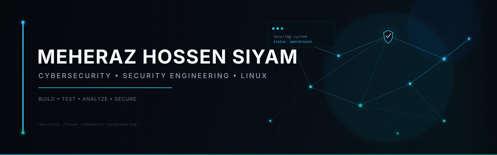

  

<h1 align="center">Meheraz Hossen Siyam</h1>

  <strong>Cybersecurity Researcher • Security Engineer • Linux Developer • Open-Source Builder</strong>

  
  

---

# 👨‍💻 About Me

I build and research in **cybersecurity, Linux systems, security tooling, and open-source software**.

My primary technical focus is **web application security and offensive security**, supported by hands-on work with Linux, networking, automation, vulnerability research, and security labs.

I approach security from an engineering perspective:

> **Understand → Build → Test → Break → Analyze → Fix → Document**

Rather than only learning security tools, I focus on understanding the systems behind them and building reproducible environments where vulnerabilities can be investigated safely.

### Current Areas

* 🔐 Web Application Security
* 🧪 Authorized Penetration Testing
* 🔎 Vulnerability Research
* 🐧 Linux System Engineering
* ⚙️ Security Automation
* 🛠️ Cybersecurity Tool Development
* 🌐 Network Security
* 📦 Linux Distribution & Package Development
* 🔀 Open-Source Engineering
* 📝 Security Reporting & Technical Documentation

---

# 🛡️ Cybersecurity

My security work currently centers around **web security, offensive security, vulnerability analysis, and Linux environments**.

### Security Knowledge & Practice

* Reconnaissance & Enumeration
* Web Application Security
* Authentication & Authorization
* Access Control
* Injection Vulnerabilities
* Cross-Site Scripting (XSS)
* SQL Injection
* Security Misconfiguration
* Privilege Escalation
* Linux Security
* Network Security
* Vulnerability Assessment
* Security Automation
* Exploit-Development Fundamentals
* Security Labs & CTF Environments
* Bug Bounty Methodology

### Security Toolkit

---

# 🐧 Linux & Systems Engineering

Linux is both my primary development environment and an area of technical work.

I work with:

* Linux administration
* Bash scripting
* Debian-based systems
* Package management
* System services
* Networking
* Virtualization
* System troubleshooting
* System hardening
* Debian Live Build
* Linux packaging
* GNOME environments
* Open-source system development

I am particularly interested in the engineering behind Linux distributions — including **packages, repositories, system integration, installation environments, desktop components, configuration, and maintainability**.

---

# 🔧 Development

I use programming to solve security and systems problems.

### Languages

### Engineering Focus

* Security tools
* CLI utilities
* Automation
* Network programming
* Linux applications
* Security lab infrastructure
* Vulnerability reproduction
* Developer tooling
* System utilities

---

# 🌐 Web Security Labs

I build controlled environments for reproducing and studying security vulnerabilities.

My lab work includes applications and infrastructure using technologies such as:

The goal is to reproduce realistic security conditions rather than creating projects that simply demonstrate vulnerability names.

---

# 📦 Open Source & GitHub

I use GitHub as a development and research workspace rather than simply a code repository.

My projects include:

* Cybersecurity tools
* Security labs
* Linux projects
* Automation utilities
* Research experiments
* Technical write-ups
* System development
* Open-source contributions

I work with:

* Git
* Branches
* Pull Requests
* Issues
* Repository organization
* Release management
* Documentation
* Code review
* Reproducible development workflows

My focus is on making projects **understandable, reproducible, maintainable, and useful to other developers and security researchers**.

---

# 🔬 Selected Work

### 🛡️ Cybersecurity Tooling

Security-focused utilities for reconnaissance, vulnerability discovery, automation, and repetitive security workflows.

### 🧪 Security Labs

Controlled environments for practicing vulnerability discovery, exploitation, privilege escalation, and system analysis.

### 🐧 Linux Development

Linux distribution, package, desktop, and system-level experimentation with a focus on Debian-based environments.

### 🌐 Vulnerable Web Applications

Intentionally vulnerable applications designed to reproduce realistic web-security scenarios in controlled environments.

### 📚 Security Write-ups

Technical documentation covering:

**Reconnaissance → Vulnerability Identification → Exploitation → Privilege Escalation → Root Cause → Remediation**

---

# 📊 GitHub Activity

---

# 🎯 Current Focus

### Cybersecurity

* Advanced Web Application Security
* Authorized Penetration Testing
* Vulnerability Research
* Linux Security
* Network Security

### Engineering

* Python Security Tooling
* Bash Automation
* C & Low-Level Security Fundamentals
* Linux System Engineering
* Security Lab Infrastructure

### Open Source

* Linux distribution development
* Debian packaging
* GitHub projects
* Technical documentation
* Open-source contribution

---

# 🤝 Collaboration

I am interested in working on technically demanding projects involving:

* Cybersecurity
* Web Application Security
* Security Research
* Security Automation
* Linux Engineering
* Security Tooling
* Open-Source Software
* Technical Research
* Security Labs

I value projects where I can **investigate problems, take technical ownership, build solutions, test them, and document the results clearly**.

---

# 📫 Contact

---

<strong>Build. Break. Understand. Secure.</strong>

